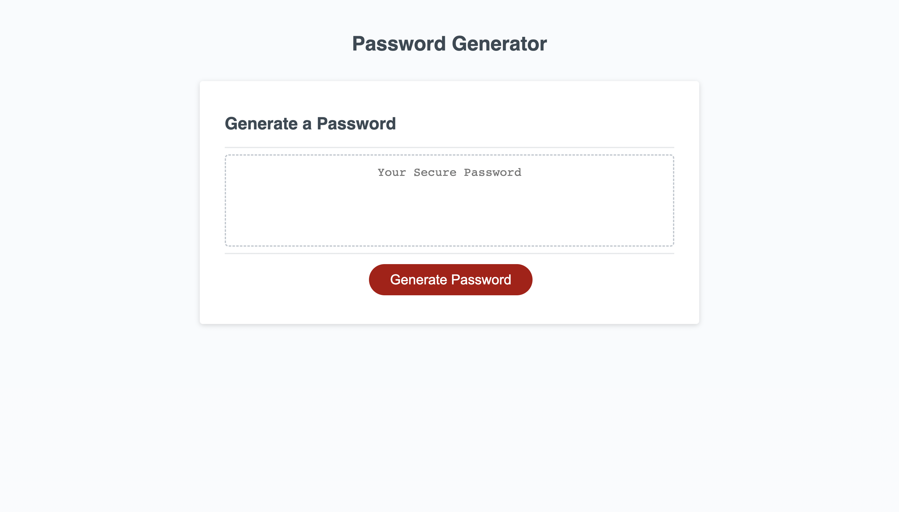

# Password-Generator
## Description

This project prompts a user to confirm password desires to get a custom password. Using this password generator will allow users to create unique passwords for any site that they may use. This will prevent them from using passwords multiple times across different sites which is not ideal.

While building this site, I learned how to use arrays, iterations, conditional statements, and functions in JavaScript.

## Installation

N/A

## Usage

To use the password generator, simply click the "Generate Password" button and read and respond to each of the messages that popup on the screen. Once they have all been repsonded to, the custom password will appear on your screen. From there, you will be able to copy and paste or write down your password.

## Credits

Tutorial followed: https://youtu.be/x4HUaiazDes

## Link

To be directed to the deployed site <a href="https://nyashanice.github.io/Password-Generator/">click here</a>